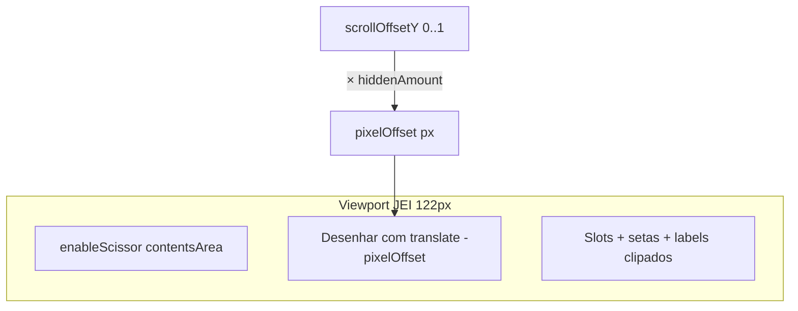
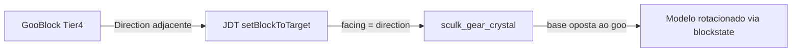

# Cristal orientável + redesign dos intermediários tech

## Parte 0 — Correção do scroll JEI (árvore de progressão)

### Sintoma (reportado in-game)

A **estrutura da árvore está correta**, mas os nós 3, 4, 5… continuam **saindo fora da área visível** do painel JEI. Com o layout atual cabem ~**2 nós por “página”** (viewport ~122px, passo vertical ~44px), porém **rolar não revela o restante** — scrollbar não reflete o conteúdo restante de forma útil.

### Causa raiz (código atual)

Em [`ProgressionTreeScrollWidget.java`](e:\Arquivos_Mods\NerdKube\src\main\java\br\com\nerdskube\integration\jei\progression\ProgressionTreeScrollWidget.java):

```java
// BUG: scrollOffsetY do AbstractScrollWidget é normalizado 0.0–1.0, NÃO pixels
int scrollOffset = Math.round(scrollOffsetY);  // resulta em 0 ou 1 px no máximo
```

O `AbstractScrollWidget` do JEI (mesmo padrão de `ScrollBoxRecipeWidget`):

- Mantém `scrollOffsetY` clampado entre **0.0 e 1.0**
- Deslocamento real em pixels = **`scrollOffsetY × getHiddenAmount()`**
- Usa **`enableScissor`** em `contentsArea` + `translate(0, -pixelOffset, 0)` antes de desenhar o conteúdo

Nossa implementação **não aplica scissor** e **não converte o offset para pixels**, então slots/setas/labels desenham fora do viewport e o scroll efetivamente não funciona.

### Correção



1. **`drawContents`** — espelhar `ScrollBoxRecipeWidget`:
   - `int pixelOffset = Math.round(scrollOffsetY * getHiddenAmount());`
   - `guiGraphics.enableScissor(contentsArea)` (coordenadas de tela: `area.x()`, `area.y()`, largura/altura de `contentsArea`)
   - `poseStack.translate(0, -pixelOffset, 0)` para setas/labels **ou** passar `pixelOffset` ao `ProgressionTreeRenderer` e posicionar slots com `y - pixelOffset`
   - `disableScissor()` no `finally`

2. **`getVisibleAmount()` / `getHiddenAmount()`** — unidades em **pixels**:
   - `getVisibleAmount()` → `contentsArea.height()` (herdado do parent; hoje retorna `area.height()` — alinhar ao JEI)
   - `getHiddenAmount()` → `max(0, computedContentHeight - getVisibleAmount())`
   - **`computedContentHeight`** calculado automaticamente em `ProgressionTreeLayout.computeContentBounds(recipe)`:
     - `maxY` entre todos os slots (incluindo grids de input multi-linha) + altura do slot (18) + margem para label de máquina (~10) + padding inferior (8)
   - Remover `contentHeight` hardcoded `440` em [`AmuletTreeDefinitions`](e:\Arquivos_Mods\NerdKube\src\main\java\br\com\nerdskube\integration\jei\progression\AmuletTreeDefinitions.java); o builder chama o cálculo no `build()`

3. **`getSlotUnderMouse`** — usar o mesmo `pixelOffset`; retornar slot só se `isMouseOver` **dentro** da área clipada (evita cliques em nós “fantasma” fora do viewport)

4. **Scrollbar coerente** — com `hiddenAmount` correto em pixels, o `AbstractScrollWidget` já dimensiona o thumb proporcionalmente (`visible / (visible + hidden)`). Garantir `handleMouseScrolled` / drag na barra funcionando via `addInputHandler(widget)` (já registrado em [`ProgressionTreeWidgetFactory`](e:\Arquivos_Mods\NerdKube\src\main\java\br\com\nerdskube\integration\jei\progression\ProgressionTreeWidgetFactory.java))

5. **Layout (opcional, só se ainda apertado após o fix)** — manter passo ~44px (≈2 nós visíveis) é aceitável **se o scroll funcionar**; se quiser ~3 nós sem rolar, reduzir `ROW_HEIGHT` de 44→36 em `AmuletTreeDefinitions` num segundo passo

### Arquivos a alterar

| Arquivo | Mudança |
|---------|---------|
| [`ProgressionTreeScrollWidget.java`](e:\Arquivos_Mods\NerdKube\src\main\java\br\com\nerdskube\integration\jei\progression\ProgressionTreeScrollWidget.java) | pixelOffset, scissor, slot hit-test |
| [`ProgressionTreeLayout.java`](e:\Arquivos_Mods\NerdKube\src\main\java\br\com\nerdskube\integration\jei\progression\ProgressionTreeLayout.java) | `computeContentHeight(recipe)` |
| [`AmuletTreeBuilder.java`](e:\Arquivos_Mods\NerdKube\src\main\java\br\com\nerdskube\integration\jei\progression\AmuletTreeBuilder.java) | auto `contentHeight` no `build()` |
| [`ProgressionTreeRenderer.java`](e:\Arquivos_Mods\NerdKube\src\main\java\br\com\nerdskube\integration\jei\progression\ProgressionTreeRenderer.java) | receber `pixelOffset` (se não usar translate global) |

### Teste específico

1. JEI → U em `sculk_gear` → árvore tech
2. Viewport mostra nós 1–2; **scroll wheel** revela nós 3–11 até `nucleo_de_materia`
3. Barra de scroll: thumb pequeno (~122/440); arrastar thumb pula para o fim da árvore
4. Nenhum slot/label desenhado fora da caixa cinza do JEI
5. Slots do nó visível continuam clicáveis (uses/receitas)

---

## Parte 1 — Cristal apontando para longe do Goo (padrão JDT)

### Como o JDT faz

Em `GooBlockBE_Base.setBlockToTarget`, quando o bloco de saída tem `BlockStateProperties.FACING`, o JDT define automaticamente:

```java
// facing = direção cardinal do goo em direção ao bloco adjacente (input)
blockState.setValue(FACING, direction)
```

Ou seja: o cristal **cresce na direção `facing`** e a **base fica oposta ao goo** — exatamente o comportamento desejado. Não é preciso lógica custom no NerdKube; basta o bloco expor `facing`.

Referência de blockstate no JDT: `raw_ferricore_ore.json` — 6 variantes (`up/down/north/south/east/west`) com rotações `x`/`y` no modelo base.

### Estado atual do NerdKube

- [`ModBlocks.java`](e:\Arquivos_Mods\NerdKube\src\main\java\br\com\nerdskube\registry\ModBlocks.java): `sculk_gear_crystal` é `Block` vanilla, **sem `facing`**
- [`sculk_gear_crystal.json` (blockstate)](e:\Arquivos_Mods\NerdKube\src\main\resources\assets\nerdkube\blockstates\sculk_gear_crystal.json): variante única `""`
- [`sculk_gear_goospread.json`](e:\Arquivos_Mods\NerdKube\src\main\resources\data\nerdkube\recipe\sculk_gear_goospread.json): sem `Properties` (ok — JDT preenche em runtime)
- [`bootstrap_tech_assets.py`](e:\Arquivos_Mods\NerdKube\tools\bootstrap_tech_assets.py) **sobrescreve** o blockstate para variante única — precisa parar de fazer isso

### Implementação



1. Criar [`SculkGearCrystalBlock`](e:\Arquivos_Mods\NerdKube\src\main\java\br\com\nerdskube\block\SculkGearCrystalBlock.java) estendendo `DirectionalBlock`:
   - Propriedade `FACING` (6 direções, igual JDT)
   - `getStateForPlacement` → facing do contexto (criativo)
   - `createBlockStateDefinition` registra `FACING`
   - Opcional: `VoxelShape` por facing (como `BaseRawOre` do JDT) para colisão realista

2. Atualizar blockstate com **6 variantes** espelhando o JDT:

| facing | rotação |
|--------|---------|
| up | (padrão) |
| down | x: 180 |
| north | x: 90 |
| south | x: 90, y: 180 |
| east | x: 90, y: 90 |
| west | x: 90, y: 270 |

3. Validar modelo Blockbench [`sculk_gear_crystal.json`](e:\Arquivos_Mods\NerdKube\src\main\resources\assets\nerdkube\models\block\sculk_gear_crystal.json):
   - Com `facing=up`, a **base** deve estar em Y baixo e a ponta para cima
   - Se a base não estiver alinhada, reexportar de [`docs/blockbench/gear_crystal.json`](e:\Arquivos_Mods\NerdKube\docs\blockbench\gear_crystal.json) ajustando origem

4. Remover do `bootstrap_tech_assets.py` a escrita do blockstate (manter só cópia de textura PNG se necessário)

5. Teste in-game: Goo T4 + `machine_frame` ao norte/sul/leste/oeste → cristal com base voltada para o goo

---

## Parte 2 — Renomear IDs + texturas + lore

### Mapeamento registry (IDs novos)

| ID atual | ID novo | Nome PT |
|----------|---------|---------|
| `fragmento_stage1` | `fragmento_matriz_dados` | Fragmento de Matriz de Dados |
| `componente_stage1_completo` | `processador_antimateria_insana` | Processador de Antimatéria Insana |
| `sculk_gear` | `mecanismo_sombra_corrompido` | Mecanismo Corrompido por Sombra |
| `fragmento_stage2` | `nucleo_logico_infundido` | Núcleo Lógico Infundido |
| `componente_stage2_completo` | `matriz_modular_estabilizada` | Matriz Modular Estabilizada |
| `placa_mae` | `chassi_cyber_flux` | Chassi Cyber-Flux |
| `circulo_escuridao` | `disco_materia_escura` | Disco de Matéria Escura Condensada |
| `escuridao_instavel` | `singularidade_hipercarregada` | Singularidade Hipercarregada |

**Nota:** quebra saves com itens antigos nos inventários — aceito pelo escopo escolhido.

### Texturas (matrizes 12×12 únicas)

Para cada item, criar pasta em `docs/textures/item/<novo_id>/`:

```
docs/textures/item/fragmento_matriz_dados/
├── meta.json
└── options/a/
    ├── option.json
    ├── palette.json    # cores da spec do usuário
    └── matrix.txt      # matriz 12×12 fornecida
```

Palettes por item (chars da spec):

| Item | Chars |
|------|-------|
| fragmento_matriz_dados | `.` `#` `X` `O` `+` |
| processador_antimateria_insana | `.` `#` `X` `O` `+` |
| mecanismo_sombra_corrompido | `.` `#` `X` `+` |
| nucleo_logico_infundido | `.` `#` `X` `O` `+` |
| matriz_modular_estabilizada | `.` `#` `X` `O` |
| chassi_cyber_flux | `.` `#` `X` `O` |
| disco_materia_escura | `.` `#` `X` `O` |
| singularidade_hipercarregada | `.` `#` `X` `O` |

Rodar `python tools/generate_textures.py` → PNGs em `textures/item/<novo_id>.png`.

Remover os 8 itens de `ITEMS` em [`bootstrap_tech_assets.py`](e:\Arquivos_Mods\NerdKube\tools\bootstrap_tech_assets.py) (não sobrescrever art final).

### Lore no tooltip

Criar [`ProgressionLoreItem`](e:\Arquivos_Mods\NerdKube\src\main\java\br\com\nerdskube\item\ProgressionLoreItem.java):

```java
@Override
public void appendHoverText(...) {
    tooltip.add(Component.translatable("item.nerdkube." + id + ".lore")
        .withStyle(ChatFormatting.GRAY, ChatFormatting.ITALIC));
}
```

Registrar os 8 itens com essa classe em [`ModItems.java`](e:\Arquivos_Mods\NerdKube\src\main\java\br\com\nerdskube\registry\ModItems.java).

Lang keys novas:
- `item.nerdkube.<id>` — nome exibido PT/EN
- `item.nerdkube.<id>.lore` — texto da spec (PT); traduzir EN

### Propagação do rename (checklist)

| Camada | Arquivos |
|--------|----------|
| Java | `ModItems.java`, `ModCreativeTabs.java` |
| Models/textures | renomear `models/item/*.json`, `textures/item/*.png` |
| Datapack | `data/nerdkube/recipe/tech/*.json`, `nucleo_materia_pressure.json`, `sculk_gear_goospread.json` |
| Loot | `loot_table/blocks/sculk_gear_crystal.json` → drop `mecanismo_sombra_corrompido` |
| Lang | `pt_br.json`, `en_us.json` (nomes + lore + JEI) |
| JEI | `NerdKubeJeiRecipes.java`, [`AmuletTreeDefinitions.java`](e:\Arquivos_Mods\NerdKube\src\main\java\br\com\nerdskube\integration\jei\progression\AmuletTreeDefinitions.java) (node IDs + inputs) |
| Docs | [`tech-progression.md`](e:\Arquivos_Mods\NerdKube\docs\modpack\tech-progression.md), `docs/textures/README.md` |

Atualizar slugs JEI (`nerdkube.jei.info.*`, `nerdkube.jei.progression.machine.*`) para os novos IDs ou manter aliases legíveis — preferir **alinhar slugs aos novos IDs** para consistência.

---

## Parte 3 — Validação

1. `.\gradlew build`
2. Goo Spread: cristal em 4 direções cardinais, base sempre voltada ao goo
3. Inventário: 8 silhuetas distintas (placa, engrenagem, capacitor, prisma, CPU, disco, órbita)
4. Tooltip: lore cinza/itálico em cada item
5. JEI: árvore tech com scroll funcional (nós 3+ visíveis ao rolar); receitas datapack carregam sem erro (`/reload`)

---

## Ordem sugerida de execução

1. **Fix scroll JEI** (Parte 0 — desbloqueia visualização dos 11 nós tech)
2. Bloco cristal com `facing` + blockstate
3. Matrizes + `generate_textures.py` para os 8 itens
4. Rename em massa (Java → datapack → JEI → lang)
5. `ProgressionLoreItem` + lore lang
6. Build + teste in-game
