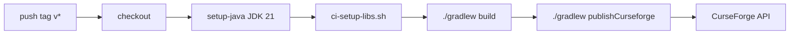

# Plano: Publicação CurseForge + README NerdKube

## Contexto técnico confirmado

| Item | Valor atual |
|------|-------------|
| JDK | **21** — [`build.gradle`](e:\Arquivos_Mods\NerdKube\build.gradle) linha `java.toolchain.languageVersion = JavaLanguageVersion.of(21)` |
| Mod ID / versão | `nerdkube` / `0.6.0` — [`gradle.properties`](e:\Arquivos_Mods\NerdKube\gradle.properties) |
| JAR principal | **`build/libs/nerdkube-0.6.0.jar`** — padrão Gradle: `archivesName` (`mod_id`) + `-` + `version` |
| JARs auxiliares | `nerdkube-0.6.0-sources.jar` (ignorar no upload) |
| `.gitignore` | Já existe em [`.gitignore`](e:\Arquivos_Mods\NerdKube\.gitignore), mas **incompleto** |
| CI existente | Nenhum (pasta `.github/` ausente) |
| Fonte do README | [`docs/MANIFESTO.md`](e:\Arquivos_Mods\NerdKube\docs\MANIFESTO.md) + classes Java/JSON citadas abaixo |



---

## 1. Reforçar `.gitignore` (não recriar do zero)

O arquivo atual já cobre Gradle, IDEA, VS Code, `run/` e `libs/*.jar`. **Adicionar** o que falta, sem remover entradas úteis:

```gitignore
# Execução local NeoForge / logs
runClient/
runServer/
logs/
*.log

# Eclipse / bin
.bin/
```

Manter `libs/*.jar` ignorado (não versionar mods de terceiros).

---

## 2. Resolver bloqueio de CI: dependências `compileOnly`

O `./gradlew build` **falha no GitHub** sem JARs em `libs/`, porque o `modpack_mods_dir` aponta para `G:/...` (inexistente no runner) e os imports abaixo exigem bytecode em compile-time:

| JAR (`gradle.properties`) | Uso no código |
|---------------------------|---------------|
| `Jade-...jar` | `FermentationJarJadeProvider`, `PedestalJadeProvider` |
| `FarmersDelight-...jar` | `CookingPotBlockEntityMixin` |
| `oritech-...jar` | mixins Laser Arm / Destroyer |
| `justdirethings-...jar` | `BaseMachineBEMixin` |
| `Mekanism-...jar` + `MekanismGenerators-...jar` | `RecipeOverrideHandler` |

**Criar** [`scripts/ci-setup-libs.sh`](e:\Arquivos_Mods\NerdKube\scripts\ci-setup-libs.sh):

- Criar `libs/` se não existir
- Baixar os 6 JARs com nomes **exatos** já definidos em `gradle.properties` (via URLs Modrinth/CurseForge CDN documentadas no script, ou API Modrinth por slug + versão MC 1.21.1 NeoForge)
- Falhar com mensagem clara se algum download falhar

O workflow chama esse script **antes** do `./gradlew build`.

---

## 3. Workflow `.github/workflows/release.yml`

### Decisão sobre a action de upload

- `dwscripter/curseforge-upload@v2` → **404** (não existe)
- `hypherionmc/publish-mods@v2` → **404** (não existe como GitHub Action)
- **Solução alinhada ao ecossistema Hypherion:** plugin Gradle **ModPublisher** (`com.hypherionmc.modutils.modpublisher`, mantido por firstdarkdev/Hypherion) + task `publishCurseforge` no workflow

Isso entrega o mesmo objetivo (upload automático na tag) com a stack que o usuário indicou, só que via Gradle em vez de action inexistente.

### Alterações em [`build.gradle`](e:\Arquivos_Mods\NerdKube\build.gradle)

- Adicionar repositório `https://maven.firstdarkdev.xyz/releases/`
- Aplicar plugin ModPublisher (versão estável recente, ex. `2.1.6`)
- Bloco `publisher { ... }` mínimo:
  - `apiKeys.curseforge` ← `System.getenv("CURSEFORGE_TOKEN")`
  - `curseID` ← `System.getenv("CURSEFORGE_PROJECT_ID")` (secret, conforme escolha do usuário)
  - `setArtifact(tasks.jar)`
  - `gameVersions`: `["1.21.1"]`
  - `loaders`: `["neoforge"]`
  - `versionType`: `release` (ou `beta` nas primeiras tags)
  - `changelog`: corpo do GitHub Release ou texto gerado da tag

### Estrutura do workflow

```yaml
name: Release
on:
  push:
    tags: ['v*']

jobs:
  release:
    runs-on: ubuntu-latest
    steps:
      - uses: actions/checkout@v4
      - uses: actions/setup-java@v4
        with:
          distribution: temurin
          java-version: '21'
          cache: gradle
      - name: Fetch compile-only libs
        run: bash scripts/ci-setup-libs.sh
      - name: Build
        run: chmod +x gradlew && ./gradlew build -Pmod_version=${VERSION#v}
        env:
          VERSION: ${{ github.ref_name }}
      - name: Publish to CurseForge
        run: ./gradlew publishCurseforge -Pmod_version=${VERSION#v}
        env:
          CURSEFORGE_TOKEN: ${{ secrets.CURSEFORGE_TOKEN }}
          CURSEFORGE_PROJECT_ID: ${{ secrets.CURSEFORGE_PROJECT_ID }}
          VERSION: ${{ github.ref_name }}
```

**Sincronização de versão:** tag `v0.6.0` → `-Pmod_version=0.6.0` para alinhar JAR e metadados do mod com a tag.

**Secrets a configurar no GitHub** (Settings → Secrets → Actions):

| Secret | Uso |
|--------|-----|
| `CURSEFORGE_TOKEN` | API token CurseForge |
| `CURSEFORGE_PROJECT_ID` | ID numérico do projeto (não hardcodar no repo) |

**Pré-requisito manual:** criar o projeto vazio na CurseForge (NeoForge, MC 1.21.1) antes do primeiro push de tag.

---

## 4. `README.md` na raiz (estrutura bilingue)

Criar [`README.md`](e:\Arquivos_Mods\NerdKube\README.md) na raiz. O mod chama-se **NerdKube** (`nerdkube`); o título em inglês seguirá o pedido do usuário com nota de nome do mod.

### Seção em inglês (topo)

1. **`# PROJECT MANIFESTO: NERDKUBE`**
2. **`## DESCRIPTION`** — visão imersiva dos 4 pilares (Technology, Magic, Exploration, Agriculture) + ritual `cube_maker` → `nerd_cube`, alinhada ao pack *Nerds Quadrados* pós-End Remastered
3. **`## SUMMARY OF PROGRESSION`** — índice navegável com links âncora para todas as seções (EN + link para bloco PT-BR)
4. **`## TEXTUAL EVOLUTION FLOWCHART`** — flowchart em setas (`──>` / `➔`) do Stage 1 até **Forbidden Transmutation Dust** (`poeira_transmutacao_proibida`), traduzido do [`docs/MANIFESTO.md`](e:\Arquivos_Mods\NerdKube\docs\MANIFESTO.md) §3

### Seção em português (fim do documento)

**`## DETALHAMENTO DA PROGRESSÃO REAL POR MÓDULO (PT-BR)`** — mecânicas **exatas do código**, não marketing:

| Módulo | Fontes principais |
|--------|-------------------|
| **Indústria** | Receitas `data/nerdkube/recipe/` (pressure, alloy, atomic, empowerer); mixin JDT `BaseMachineBEMixin`; itens até `nucleo_de_materia` |
| **Magia** | Rituais Occultism/Malum/EvilCraft/Ars em JSON; `coracao_arcano` |
| **Cozinha** | `RunicDoughRitualHandler` (Cristal Mestre + massa no chão); `agri_core.json` Botany Pots; **`FermentationJarBlockEntity`** + **`FermentationJarJadeProvider`** (72 dias = 1.728.000 ticks, barra Jade, selo `fermentation_ready_at`); mixin FD `CookingPotBlockEntityMixin` |
| **Combate** | **`VoidWormSoulHandler`** (1 fragmento por kill Void Worm/Grizzly); loot masmorra; craft `lamina_conquistador`; ritual `ExplorationAmuletCraftHandler` |
| **Alquimia proibida** | **`ForbiddenTransmutationHandler`**: Shift+clique, Beacon, 30 níveis, 2% chance, EMC 0 |

Incluir bloco curto de **requisitos** (MC 1.21.1, NeoForge 21.1.233, JDK 21) e comandos `gradlew build` / deploy local.

**Não duplicar** `docs/MANIFESTO.md` integralmente — README é face pública; manifesto permanece como doc interna detalhada.

---

## 5. Ajustes menores correlatos

- Atualizar [`libs/README.md`](e:\Arquivos_Mods\NerdKube\libs\README.md): referência obsoleta `nerdkube-0.2.0-SNAPSHOT.jar` → `nerdkube-0.6.0.jar` + nota sobre `ci-setup-libs.sh`
- Validar build local após mudanças: `.\gradlew build`
- Primeiro teste de release: tag `v0.6.0` após secrets configurados

---

## Riscos e mitigações

| Risco | Mitigação |
|-------|-----------|
| URLs de download dos JARs quebrarem | Script com versões fixas + comentário para atualizar junto com `gradle.properties` |
| Versão em `gradle.properties` divergir da tag | Workflow sempre passa `-Pmod_version` derivado da tag |
| ModPublisher API mudar | Fixar versão do plugin; upload isolado em `publishCurseforge` |
| ProjectE ausente no pack | README deixa claro: integração opcional, código já pronto |
