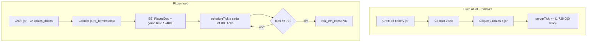

# Plano: Fermentação simplificada por dia do Minecraft

## Problema atual

O fluxo em [`FermentationJarBlock`](e:\Arquivos_Mods\NerdKube\src\main\java\br\com\nerdskube\block\FermentationJarBlock.java) exige **dois passos** (craft só com `bakery:jar` + clique com 3 raízes + 1 jar) e usa **`serverTick` a cada tick** incrementando `CookingProgress` — isso é frágil, difícil de depurar e o Jade depende de `fermenting=true`, que muitas vezes nunca é setado se o clique falhar.



---

## Novo comportamento (especificação)

| Etapa | Comportamento |
|-------|---------------|
| **Craft** | Shapeless: `bakery:jar` + 3× `nerdkube:raizes_doces` (posições livres) → `nerdkube:jarro_fermentacao` |
| **Colocar** | Grava `PlacedDay` = `level.getGameTime() / 24_000` no BE (dia numérico MC) |
| **Jade** | Mostra **dias no chão** e **%** (`diasDecorridos / 73`) — sem barra de ticks/real-time |
| **Conversão** | Quando `diasDecorridos >= 73` → bloco vira `nerdkube:raiz_em_conserva` (mesmo visual/stack de hoje) |
| **Sem clique** | Remover `useItemOn` / `tryStart` / consumo de inventário no bloco |
| **Performance** | **Sem** `BlockEntityTicker` por tick; usar `level.scheduleTick(pos, block, 24_000)` recursivo |

**Fórmulas** ([`FermentationConstants`](e:\Arquivos_Mods\NerdKube\src\main\java\br\com\nerdskube\integration\agriculture\FermentationConstants.java)):

```java
public static final int MC_DAY_TICKS = 24_000;
public static final int FERMENT_DAYS = 73;  // era 72 — alinhar ao pedido

public static long currentDay(Level level) {
    return level.getGameTime() / MC_DAY_TICKS;
}

public static long daysOnGround(long placedDay, Level level) {
    return Math.max(0L, currentDay(level) - placedDay);
}

public static int percent(long placedDay, Level level) {
    return (int) Math.min(100L, (daysOnGround(placedDay, level) * 100L) / FERMENT_DAYS);
}

public static boolean isReady(long placedDay, Level level) {
    return daysOnGround(placedDay, level) >= FERMENT_DAYS;
}
```

---

## Arquivos a modificar

### 1. Receita — [`jarro_fermentacao_craft.json`](e:\Arquivos_Mods\NerdKube\src\main\resources\data\nerdkube\recipe\agricultura\jarro_fermentacao_craft.json)

Trocar ingrediente único por shapeless com 4 itens:

```json
"ingredients": [
  { "item": "bakery:jar" },
  { "item": "nerdkube:raizes_doces" },
  { "item": "nerdkube:raizes_doces" },
  { "item": "nerdkube:raizes_doces" }
]
```

### 2. [`FermentationJarBlockEntity.java`](e:\Arquivos_Mods\NerdKube\src\main\java\br\com\nerdskube\block\entity\FermentationJarBlockEntity.java)

- **Remover:** `cookingProgress`, `fermenting`, `startFermentation()`, `applyMigrationProgress()`, `serverTick()`
- **Adicionar:** `long placedDay` (NBT `PlacedDay`)
- **Manter:** `completeFermentation()` (swap de bloco + partículas/som) — **sem** setar BE do jarro em conserva
- Métodos: `getPlacedDay()`, `initPlacedDay(Level)` (só se `placedDay == 0`)

### 3. [`FermentationJarBlock.java`](e:\Arquivos_Mods\NerdKube\src\main\java\br\com\nerdskube\block\FermentationJarBlock.java)

- **Remover:** `getTicker`, `useItemOn`, `tryStart`, `countItem`, `consume`, imports de inventário
- **Adicionar:**
  - `setPlacedBy` → `initPlacedDay` + `scheduleTick(..., MC_DAY_TICKS)`
  - `tick(BlockState, ServerLevel, ...)` → se `isReady` → `completeFermentation`, senão reagenda `scheduleTick`
  - `onLoad` (via BE `onLoad`) → reagendar tick se chunk recarregar com jarro no chão
- **Manter:** `getDestroyProgress` retorna 0 enquanto `!isReady` (impede quebrar antes dos 73 dias)

### 4. [`FermentationJarJadeProvider.java`](e:\Arquivos_Mods\NerdKube\src\main\java\br\com\nerdskube\integration\jade\FermentationJarJadeProvider.java)

Sincronizar `PlacedDay` + `CurrentDay` no server data. Tooltip simples:

- `nerdkube.jade.ferment.days_on_ground` → "No chão há X dias"
- `nerdkube.jade.ferment.progress` → "X% fermentado"
- Remover barra de progresso por ticks e tempo real estimado

### 5. [`SweetRootsJarBlock.java`](e:\Arquivos_Mods\NerdKube\src\main\java\br\com\nerdskube\block\SweetRootsJarBlock.java)

- Converter de `BaseEntityBlock` → **`Block` simples** (sem BlockEntity)
- `removeOne`: sempre `FermentationSeal.markReady(stack, level.getGameTime())` ao coletar
- Remover `applySealFromBlockEntity`

### 6. Registros — [`ModBlockEntities.java`](e:\Arquivos_Mods\NerdKube\src\main\java\br\com\nerdskube\registry\ModBlockEntities.java)

- Remover tipo `PRESERVED_ROOTS_JAR`
- Manter apenas `FERMENTATION_JAR`

### 7. Selo no item (manter leve)

- **Manter** [`FermentationSeal`](e:\Arquivos_Mods\NerdKube\src\main\java\br\com\nerdskube\integration\agriculture\FermentationSeal.java) + [`CookingPotBlockEntityMixin`](e:\Arquivos_Mods\NerdKube\src\main\java\br\com\nerdskube\mixin\farmersdelight\CookingPotBlockEntityMixin.java) — anti-cheat para `/give` sem fermentar
- Selo aplicado **só no item** ao coletar/quebrar `raiz_em_conserva`, não mais NBT no bloco

### 8. Lang + JEI

- [`pt_br.json`](e:\Arquivos_Mods\NerdKube\src\main\resources\assets\nerdkube\lang\pt_br.json) / [`en_us.json`](e:\Arquivos_Mods\NerdKube\src\main\resources\assets\nerdkube\lang\en_us.json): novas chaves Jade; remover `nerdkube.ferment.started` / `in_progress`
- [`NerdKubeJeiRecipes.java`](e:\Arquivos_Mods\NerdKube\src\main\java\br\com\nerdskube\integration\jei\NerdKubeJeiRecipes.java): texto do jarro = craft com raízes + 73 dias no chão
- [`docs/MANIFESTO.md`](e:\Arquivos_Mods\NerdKube\docs\MANIFESTO.md) + [`agriculture-progression.md`](e:\Arquivos_Mods\NerdKube\docs\modpack\agriculture-progression.md)

---

## Arquivos a deletar

| Arquivo | Motivo |
|---------|--------|
| [`PreservedRootsJarBlockEntity.java`](e:\Arquivos_Mods\NerdKube\src\main\java\br\com\nerdskube\block\entity\PreservedRootsJarBlockEntity.java) | NBT no bloco conservado não é mais necessário |
| [`FermentationSavedData.java`](e:\Arquivos_Mods\NerdKube\src\main\java\br\com\nerdskube\integration\agriculture\FermentationSavedData.java) | Migração legada bakery:jar |
| [`FermentationLegacyMigration.java`](e:\Arquivos_Mods\NerdKube\src\main\java\br\com\nerdskube\integration\agriculture\FermentationLegacyMigration.java) | Idem |

---

## Loot table — selo ao quebrar

[`raiz_em_conserva.json`](e:\Arquivos_Mods\NerdKube\src\main\resources\data\nerdkube\loot_table\blocks\raiz_em_conserva.json) hoje não aplica selo. Opções (escolher a mais simples na implementação):

- **A (recomendada):** override `getDrops` em `SweetRootsJarBlock` para chamar `FermentationSeal.markReady` em cada stack
- **B:** loot function custom (mais complexo, evitar)

---

## Teste manual pós-implementação

1. Craft: `bakery:jar` + 3 raízes → `jarro_fermentacao`
2. Colocar no chão → Jade mostra "0 dias" / "0%"
3. `/time add 24000` × 73 → bloco converte para `raiz_em_conserva`
4. Coletar jarro conservado → tooltip verde "selado"; Cooking Pot `semente_criacao` aceita
5. Tentar quebrar jarro fermentando antes dos 73 dias → indestrutível
6. Chunk unload/reload → progresso preservado via `PlacedDay` no NBT

---

## Relação com plano CurseForge

Independente do pipeline de release. Após esta refatoração, atualizar a seção PT-BR do futuro `README.md` (fermentação por dia MC, não por ticks).
