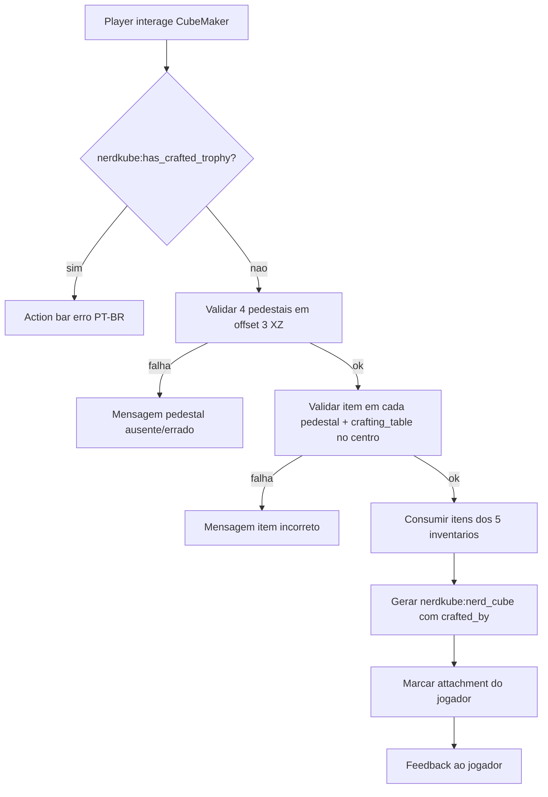

# Plano: Sistema de Endgame NerdKube (Ritual NerdCube)

## Decisões confirmadas

| Tópico | Decisão |
|--------|---------|
| Mod ID | **`nerdkube`** (sem rename; itens ficam `nerdkube:*`) |
| Pedestais | 4 componentes próprios nos pedestais; **centro do CubeMaker = `minecraft:crafting_table`** |
| Mapeamento direção → item | Norte=Tech=`nucleo_de_materia`, Sul=Magia=`coracao_arcano`, Leste=Exploração=`reliquia_desbravador`, Oeste=Agricultura=`semente_criacao` |

## Arquitetura



## 1. Camada de registro (NeoForge 1.21.1)

Criar pacote `br.com.nerdskube.registry` e registrar via `DeferredRegister` no construtor de [`NerdKube.java`](e:\Arquivos_Mods\NerdKube\src\main\java\br\com\nerdskube\NerdKube.java):

| Registro | ID | Notas |
|----------|-----|-------|
| Item | `nucleo_de_materia` | simple item |
| Item | `coracao_arcano` | simple item |
| Item | `reliquia_desbravador` | simple item |
| Item | `semente_criacao` | simple item |
| Block + BE | `cube_maker` | interativo, GUI, 1 slot central |
| Block + BE | `ritual_pedestal` | 1 slot, aceita só 1 stack |
| Block + BE | `nerd_cube` | `explosionResistance=3600000`, `lightLevel=15`, indestrutível em survival |

**Mocks visuais** em `src/main/resources/assets/nerdkube/models/` apontando para texturas do Mystical Agriculture (sem depender do JAR em compile):

| Nosso asset | Referência mock |
|-------------|-----------------|
| `nucleo_de_materia` | `mysticalagriculture:item/soulium_ingot` |
| `coracao_arcano` | `mysticalagriculture:item/soulium_gem` |
| `reliquia_desbravador` | `mysticalagriculture:item/cognizant_dust` |
| `semente_criacao` | `mysticalagriculture:item/mystical_fertilizer` |
| `cube_maker` | `infusion_altar` side/top |
| `ritual_pedestal` | `infusion_pedestal` |
| `nerd_cube` | `awakened_supremium_block` |

Exemplo de item model:

```json
{
  "parent": "minecraft:item/generated",
  "textures": { "layer0": "mysticalagriculture:item/soulium_ingot" }
}
```

## 2. BlockEntities e inventário

Pacote `br.com.nerdskube.block.entity`:

- **`RitualPedestalBlockEntity`**: `ItemStackHandler` de 1 slot; salvar/carregar via `ContainerHelper` / `loadAdditional` + `saveAdditional`.
- **`CubeMakerBlockEntity`**: `ItemStackHandler` de 1 slot (crafting table); expõe `MenuProvider`.
- **`NerdCubeBlockEntity`**: campo `String craftedBy`; sincronizar client/server com `BlockEntity` codec ou `SynchedEntityData` via payload simples.

Pacote `br.com.nerdskube.block`:

- `RitualPedestalBlock` — não dropa conteúdo ao quebrar sem `Silk Touch`? (padrão: dropar conteúdo + bloco).
- `CubeMakerBlock` — `use()` abre menu no server; `getTicker` não necessário.
- `NerdCubeBlock` — `destroySpeed = -1`, `explosionResistance = 3600000`; ao receber `ItemStack` no place, copiar dados customizados para BE; `playerWillDestroy` retorna stack com assinatura.

## 3. GUI do CubeMaker

Pacote `br.com.nerdskube.menu`:

- `CubeMakerMenu` + `CubeMakerScreen` (client-only em `br.com.nerdskube.client`)
- 1 slot de input + botão/ação **“Fabricar”** que chama `RitualService.tryPerform(...)` no server
- Slot aceita apenas `minecraft:crafting_table`

Registrar `ModMenus` e `RegisterMenuScreensEvent` no client setup.

## 4. Lógica do ritual

Pacote `br.com.nerdskube.ritual`:

**`PedestalDirection` enum** com offsets fixos a partir do `CubeMaker`:

```java
NORTH(0, 0, -3, ModItems.NUCLEO_DE_MATERIA),
SOUTH(0, 0,  3, ModItems.CORACAO_ARCANO),
EAST( 3, 0,  0, ModItems.RELIQUIA_DESBRAVADOR),
WEST(-3, 0,  0, ModItems.SEMENTE_CRIACAO);
```

**`RitualValidator`**:
1. Para cada direção, `level.getBlockEntity(center.offset(dx,0,dz))` deve ser `RitualPedestalBlockEntity`
2. Slot do pedestal deve conter exatamente 1× o item esperado (`ItemStack.is(item)`)
3. `CubeMakerBlockEntity` deve ter 1× `minecraft:crafting_table`

**`RitualService.performRitual(Level, BlockPos center, Player player)`**:
1. `PlayerRitualData.hasCrafted(player)` → se true, `player.displayClientMessage(..., true)` com texto do spec (ajustado para `nerdkube`)
2. Rodar `RitualValidator`; mensagens de erro específicas por falha (pedestal ausente vs item errado)
3. Consumir stacks dos 4 pedestais + crafting table
4. `PlayerRitualData.setCrafted(player, true)`
5. Criar `ItemStack` de `nerd_cube` com componente customizado (ver §5)
6. Dar ao player ou dropar no centro se inventário cheio

## 5. Dados do jogador e assinatura do troféu

### Trava 1 craft por jogador

Usar **NeoForge Data Attachments** (API 1.21+, preferível a NBT manual):

- `br.com.nerdskube.attachment.ModAttachments`
- `PlayerRitualData` record com `boolean hasCraftedTrophy`
- Chave lógica documentada como `nerdkube:has_crafted_trophy` (equivalente ao spec)

Registrar em `RegisterEvent` / `NeoForge.EVENT_BUS` no mod init.

### Assinatura no item/bloco

Em 1.21.1 usar **Data Components** (não `tag` legacy):

- Registrar `DataComponentType<String>` → `nerdkube:crafted_by`
- Ao craftar: `stack.set(ModDataComponents.CRAFTED_BY, player.getScoreboardName())`
- Lore visível: `DataComponents.LORE` com linha `"§bO nerd que fabricou foi " + name` **ou** só custom component + tooltip handler

Ao colocar bloco: `BlockItem` / `setPlacedBy` copia `crafted_by` do stack para `NerdCubeBlockEntity`.

Ao quebrar: `getCloneItemStack` / loot function preserva componente.

## 6. Integração Jade (opcional)

- Dependência opcional em [`neoforge.mods.toml`](e:\Arquivos_Mods\NerdKube\src\main\templates\META-INF\neoforge.mods.toml): `jade`
- `NerdCubeJadePlugin` implementando `IWailaPlugin` + provider para `NerdCubeBlockEntity` mostrando assinatura em PT-BR
- Só carregar classe se `ModList.get().isLoaded("jade")`

## 7. Referência BlocksItems API

Documentar em [`docs/modpack/ritual-reference.md`](e:\Arquivos_Mods\NerdKube\docs\modpack\endgame-baseline.md) (novo arquivo) os IDs usados e como consultar a API para futuras receitas:

```
GET https://blocksitems.com/api/v1/items?mod_id=mekanism&rarity=epic
GET https://blocksitems.com/api/v1/blocks?mod_id=mysticalagriculture&search=infusion
```

Os mocks visuais já usam paths confirmados pela API (`infusion_altar`, `infusion_pedestal`, `awakened_supremium_block`).

**Não** usar a API em runtime do mod — apenas referência de desenvolvimento.

## 8. Localização e docs

Atualizar [`pt_br.json`](e:\Arquivos_Mods\NerdKube\src\main\resources\assets\nerdkube\lang\pt_br.json) e `en_us.json`:

- Nomes dos 7 registros
- `nerdkube.ritual.already_crafted` = mensagem da action bar
- Erros de validação do ritual
- Tooltip/lore do troféu

Atualizar [`endgame-baseline.md`](e:\Arquivos_Mods\NerdKube\docs\modpack\endgame-baseline.md) com o fluxo do ritual pós-16-olhos.

## 9. Gradle / dependências

Em [`build.gradle`](e:\Arquivos_Mods\NerdKube\build.gradle):

- Manter `endrem` como já está
- Adicionar `jade` JAR do modpack em `compileOnly` + `localRuntime` (mesmo padrão do endrem) para compilar plugin
- **Não** adicionar hard-dep em Mystical Agriculture — mocks são só JSON de textura

## 10. Ordem de implementação

1. Registros (items, blocks, block entities, creative tab opcional)
2. Models/blockstates/lang (mocks MA)
3. Pedestal + CubeMaker BE/inventário
4. Menu CubeMaker
5. Attachments do jogador
6. RitualValidator + RitualService
7. NerdCube block (place/break/persistência)
8. Jade provider (opcional)
9. `gradlew build` + teste manual em `runClient` com estrutura em cruz

## Teste manual esperado

Montar no chão (vista superior):

```
        [pedestal N: nucleo]
              |
    [semente]—[cube_maker]—[reliquia]
              |
        [pedestal S: coracao]
```

Distância centro-a-centro = 3 blocos. Inserir `crafting_table` no CubeMaker, clicar fabricar → receber `nerd_cube` assinado; segunda tentativa bloqueada.

## Riscos / notas

- Texturas mock de `mysticalagriculture:*` só renderizam com o mod no classpath/runtime (ok no pack Nerds Quadrados).
- `player.getScoreboardName()` pode diferir do display name — aceitável conforme spec; se quiser nome amigável depois, trocar para `player.getName().getString()`.
- Receitas dos 4 componentes **fora do escopo** deste plano (só registro + ritual); podem ser adicionadas numa fase 2.
