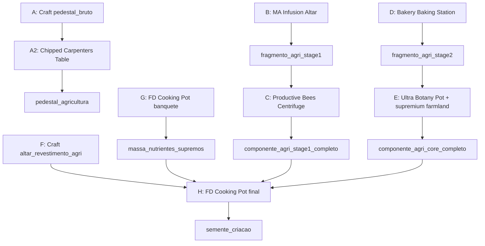

# Pilar Agricultura e Construção (NerdKube 0.5.0)

## Contexto

O scaffold já existe: [`pedestal_agricultura`](e:\Arquivos_Mods\NerdKube\src\main\java\br\com\nerdskube\registry\ModBlocks.java), [`semente_criacao`](e:\Arquivos_Mods\NerdKube\src\main\java\br\com\nerdskube\registry\ModItems.java), ritual WEST em [`PedestalDirection`](e:\Arquivos_Mods\NerdKube\src\main\java\br\com\nerdskube\ritual\PedestalDirection.java), JEI placeholder “em breve”. Falta toda a camada de conteúdo (itens, receitas, texturas, docs) como em [`magic-progression.md`](e:\Arquivos_Mods\NerdKube\docs\modpack\magic-progression.md).

## Correções de IDs (spec vs pack real)

| Spec do usuário | ID correto no pack Nerds Quadrados |
|-----------------|-----------------------------------|
| `macawsroofs:` / `macawsfurniture:` / `macawsfences:` / `macawspaths:` | `mcwroofs:`, `mcwfurnitures:`, `mcwfences:`, `mcwpaths:` |
| `rechiseled:chisled_quartz_block` | Não existe — usar variante válida, ex. `rechiseled:quartz_block_bordered` |
| `refurbished_furniture:fridge` | `refurbished_furniture:light_fridge` ou `dark_fridge` |
| `productivebees:comb_supremium` | Favo via abelha Supremium: `productivebees:configurable_honeycomb` + componente de bee type **ou** receita centrífuga existente como referência de honeycomb |
| `farmandcharm:artisanal_cheese` | **Não existe** nesta versão — substituir por item real do pack (ex. `farm_and_charm:butter` ou queijo do `bakery`) após grep no JAR |
| `botanypotstiers:netherite_botany_pot` | **Não existe** — usar **Ultra Botany Pot** (`botanypotstiers:ultra_*_botany_pot`, ex. `ultra_oak_botany_pot`) |
| `nerdcube:` / `pedestal_agriculture` | `nerdkube:` / `pedestal_agricultura` (já registrado) |

Validar todos os IDs no JEI/logs **antes** de merge (mesma disciplina de [`recipe-overrides.md`](e:\Arquivos_Mods\NerdKube\docs\modpack\recipe-overrides.md)).

## 1. Registro Java (7 itens + 1 bloco)

**Arquivos:** [`ModItems.java`](e:\Arquivos_Mods\NerdKube\src\main\java\br\com\nerdskube\registry\ModItems.java), [`ModBlocks.java`](e:\Arquivos_Mods\NerdKube\src\main\java\br\com\nerdskube\registry\ModBlocks.java), [`ModCreativeTabs.java`](e:\Arquivos_Mods\NerdKube\src\main\java\br\com\nerdskube\registry\ModCreativeTabs.java)

| ID | Tipo | Classe |
|----|------|--------|
| `pedestal_bruto` | Bloco decorativo | bloco simples (`cube_all` ou `cube_bottom_top`) + `BlockItem` |
| `fragmento_agri_stage1` | Intermediário | `ProgressionLoreItem` |
| `componente_agri_stage1_completo` | Intermediário | `ProgressionLoreItem` |
| `fragmento_agri_stage2` | Intermediário | `ProgressionLoreItem` |
| `componente_agri_core_completo` | Intermediário | `ProgressionLoreItem` |
| `altar_revestimento_agri` | Intermediário | `ProgressionLoreItem` |
| `massa_nutrientes_supremos` | Intermediário | `ProgressionLoreItem` |
| `agri_core_crop` | Bloco técnico (opcional) | bloco com `age` para Botany Pots — só se datapack exigir `block_derived_crop` |

`semente_criacao` e `pedestal_agricultura` permanecem; receita passará a existir para o pedestal.

## 2. Receitas datapack (`data/nerdkube/recipe/agricultura/`)

Espelhar estrutura de [`recipe/magia/`](e:\Arquivos_Mods\NerdKube\src\main\resources\data\nerdkube\recipe\magia).

### A — Pedestal bruto (crafting shaped)

Padrão 3×3 do spec com IDs corrigidos (`framedblocks:framed_cube`, `betterblockz:…`, `rechiseled:…`, `mysticalagriculture:supremium_block`, `mcwroofs:oak_roof`, `functionalstorage:storage_controller`).

→ `nerdkube:pedestal_bruto`

### A2 — Pedestal agricultura (Chipped)

O mod usa `chipped:workbench` para estações; a transformação `pedestal_bruto → pedestal_agricultura` provavelmente **não** é datapack simples.

**Abordagem em duas camadas:**
1. Tentar receita no estilo Chipped (Carpenters Table / workbench) após inspecionar JSON de transformação no JAR.
2. **Fallback documentado:** `minecraft:smithing_transform` ou shaped craft final com item catalisador `chipped:carpenters_table` (não consumido via recipe_remainder se suportado).

→ `nerdkube:pedestal_agricultura`

### B — Fragmento stage 1 (Mystical Agriculture Infusion)

Tipo: `mysticalagriculture:infusion` (schema em `data/mysticalagriculture/recipe/seed/infusion/diamond.json`).

- **input:** `mysticalagradditions:insanium_block`
- **ingredients (8 pedestais):** `2× mysticalagriculture:awakened_supremium_essence`, `2× mysticalagradditions:nether_star_essence`, `2× mysticalagradditions:dragon_egg_essence`, `2× mysticalagriculture:netherite_essence` (confirmar namespace exato no JAR Agradditions)
- **result:** `nerdkube:fragmento_agri_stage1`

### C — Componente stage 1 (Productive Bees Centrifuge)

`productivebees:centrifuge` aceita **um** ingrediente por receita (ver `honeycomb.json`).

**Solução:** craft intermediário `pacote_essencias_agri` (shapeless: 3× fragmento + favo supremium + `productivebees:honey_bucket`) → centrífuga → `componente_agri_stage1_completo`.

Documentar no JEI que o pacote representa a “colmeia industrial”.

### D — Fragmento stage 2 (Bakery Baking Station)

Tipo JEI: `bakery:caking`. Implementar receita após extrair um JSON de referência do JAR `letsdo-bakery`.

Ingredientes concretos (substituir narrativa vaga):
- farinha: `farmersdelight:wheat_dough` ou `farm_and_charm:dough`
- ovo: item de Alex's Mobs (ex. `alexsmobs:boiled_emu_egg` ou ovo vanilla se mais simples)
- leite: `minecraft:milk_bucket`
- catalisador não consumido: `mysticalagriculture:master_infusion_crystal` (validar suporte a `recipe_catalyst` / NBT no serializer Bakery)

→ `nerdkube:fragmento_agri_stage2`

### E — Componente core (Ultra Botany Pot)

1. Registrar bloco crop técnico `nerdkube:agri_core_crop` (blockstates `age` 0–2) se necessário para `botanypots:block_derived_crop`.
2. Datapack em `data/botanypots/recipe/nerdkube/crop/agri_core.json`:
   - **input:** `nerdkube:fragmento_agri_stage2`
   - **soil:** `mysticalagriculture:supremium_farmland` (já existe em botanypotsmystical)
   - **growth:** ~12000 ticks (10 min) via campo `growth` / modifier do schema Botany Pots
   - **drop:** `nerdkube:componente_agri_core_completo`
3. JEI: exigir **Ultra Botany Pot** (`botanypotstiers:ultra_oak_botany_pot` ou equivalente) — documentar no texto, pois o tier pode não ser filtrável só por datapack.

**Fallback** se crop custom não funcionar: evento NeoForge leve (`BotanyPotGerminationHandler`) que conta ticks quando fragmento está no vaso ultra com solo supremium.

### F — Altar de revestimento (crafting shaped)

IDs Macaw's / BetterBlockZ / Refurbished corrigidos.

→ `nerdkube:altar_revestimento_agri`

### G — Massa de nutrientes (Farmer's Delight Cooking Pot)

Tipo: `farmersdelight:cooking` (ver `beef_stew.json`).

Ingredientes:
- `farmersdelight:roast_chicken_block`
- `farmersdelight:shepherds_pie_block`
- `bakery:chocolate_cake`
- item laticínio validado do pack (substituto de `artisanal_cheese`)

→ `nerdkube:massa_nutrientes_supremos`

### H — Amuleto final (FD Cooking Pot)

`farmersdelight:cooking` com 5 ingredientes do spec:
- `altar_revestimento_agri` ×1
- `massa_nutrientes_supremos` ×2
- `componente_agri_stage1_completo` ×3
- `componente_agri_core_completo` ×3

→ `nerdkube:semente_criacao`

## 3. Texturas e assets

**Script novo:** `tools/create_agricultura_progression_textures.py` — copiar padrão de [`create_magia_progression_textures.py`](e:\Arquivos_Mods\NerdKube\tools\create_magia_progression_textures.py) com as 7 matrizes 12×12 + paletas do spec do usuário (`module: "agriculture"`).

Rodar `python tools/generate_textures.py` → PNGs em `assets/nerdkube/textures/item/`.

Criar `models/item/*.json` para cada item; `pedestal_bruto` block model + loot table em `data/nerdkube/loot_table/blocks/`.

## 4. Lang, JEI e documentação

- **Lang:** [`pt_br.json`](e:\Arquivos_Mods\NerdKube\src\main\resources\assets\nerdkube\lang\pt_br.json) + `en_us.json` — para cada item: `item.nerdkube.{id}`, `.lore`, `nerdkube.jei.info.{id}.line1/2/3` (máquina, inputs astronômicos, dica de automação).
- **JEI:** registrar todos em [`NerdKubeJeiRecipes.java`](e:\Arquivos_Mods\NerdKube\src\main\java\br\com\nerdskube\integration\jei\NerdKubeJeiRecipes.java); remover texto “fase 2 — em breve” de `semente_criacao` e `pedestal_agricultura`.
- **Doc canônica:** criar [`docs/modpack/agriculture-progression.md`](e:\Arquivos_Mods\NerdKube\docs\modpack\agriculture-progression.md) no formato de `magic-progression.md` (fluxo, tabela arquivo→máquina, notas de IDs corrigidos).

## 5. Versão e build

- [`gradle.properties`](e:\Arquivos_Mods\NerdKube\gradle.properties): `mod_version=0.5.0`, `modpack_deploy_jar=nerdkube-0.5.0.jar`
- `compileOnly` opcional para mods de receita (Productive Bees, Bakery) se mixins não forem necessários — receitas são datapack puro.
- `.\gradlew build deployToModpack` + teste in-game: JEI (R) em cada etapa, craft/infusão/centrífuga/pote/cooking pot.

## 6. Testes manuais (checklist)

1. Craft `pedestal_bruto` → finalizar em Chipped/smithing → obter `pedestal_agricultura`
2. Infusion Altar com insanium + essências → `fragmento_agri_stage1`
3. Pacote + centrífuga → `componente_agri_stage1_completo`
4. Baking Station → `fragmento_agri_stage2`
5. Ultra pot + supremium farmland ~10 min → `componente_agri_core_completo`
6. Cooking pot banquete → `massa_nutrientes_supremos`
7. Cooking pot final → `semente_criacao`
8. Ritual: 4 pedestais + `semente_criacao` no pedestal oeste → `nerd_cube`

## Riscos e mitigação

| Risco | Mitigação |
|-------|-----------|
| Bakery `caking` não suporta catalisador | Craft shaped proxy + JEI explicando uso do cristal na estação |
| Chipped não transforma item via datapack | Smithing transform como etapa A2 |
| Botany Pots sem crop custom | `BotanyPotGerminationHandler` (~80 linhas) |
| Centrifuge mono-ingrediente | Item pacote intermediário (etapa C) |
| IDs Macaw's/Rechiseled errados | Validar no JEI antes de commit |

## Escopo fora deste PR

- Pilar Exploração (Leste)
- Bloco Blockbench 3D para `pedestal_agricultura` (manter textura `cube_bottom_top` atual)
- Integração FTB Quests
