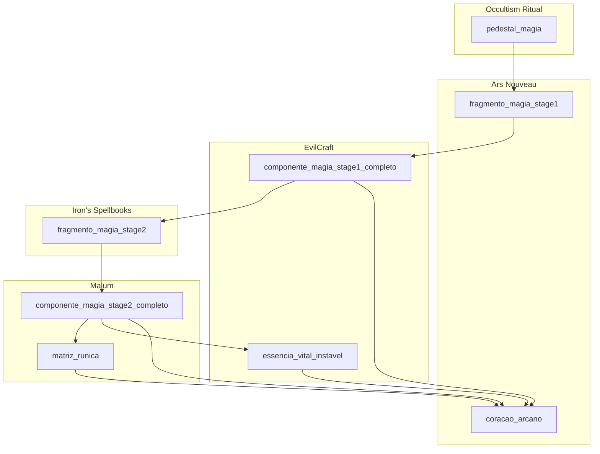

# Plano — Progressão Magia (Módulo 2)

## Contexto e escopo

A linha **tech** em [`docs/modpack/tech-progression.md`](e:\Arquivos_Mods\NerdKube\docs\modpack\tech-progression.md) é o modelo: receitas em `data/nerdkube/recipe/tech/`, itens via `ProgressionLoreItem` em [`ModItems.java`](e:\Arquivos_Mods\NerdKube\src\main\java\br\com\nerdskube\registry\ModItems.java), texturas em `docs/textures/item/`, JEI só com **Ingredient Info** (R) em [`NerdKubeJeiRecipes.java`](e:\Arquivos_Mods\NerdKube\src\main\java\br\com\nerdskube\integration\jei\NerdKubeJeiRecipes.java). A árvore JEI **permanece removida**.

**Versão alvo:** manter `0.3.0-SNAPSHOT` (ou bump opcional para `0.3.1-SNAPSHOT` ao fechar magia).

**Namespace:** sempre `nerdkube:` (não `nerdcube:`).



---

## 1. Correções de IDs (spec → pack real)

Validados nos JARs da instância **Nerds Quadrados**:

| Spec do usuário | ID real no pack | Notas |
|-----------------|-----------------|-------|
| `irons_spells:*` | `irons_spellbooks:*` | Mod ID correto |
| `malum:soul_stained_steel_block` | `malum:block_of_soul_stained_steel` | Bloco de armazenamento |
| `evilcraft:garmon_booster` | `evilcraft:garmonbozia` | Item do Blood Infuser |
| `occultism:marid_actuator` | `occultism:miner_marid_master` | **Confirmado pelo usuário** |
| `irons_spellbooks:blank_scroll` | `irons_spellbooks:scroll` | Não existe `blank_scroll`; scroll base do mod |
| Sangue purificado 10 000 mB | `evilcraft:blood` + `"tier": 3` | Sem fluido `purified_blood` em datapack; tier III = Promise III |
| Mesa de Inscrição (datapack) | `minecraft:crafting_shaped` | ISS **não expõe** receitas datapack para Inscription Table — usar craft 3×3 equivalente + JEI descreve o fluxo temático |
| Envigorating Basin (datapack) | `evilcraft:blood_infuser` (passo 2) | Sanguinary Environmental Accumulator **não tem** receitas JSON no EvilCraft 1.2.89 — segundo passo via Blood Infuser com `irons_spellbooks:ruined_book` |

**Malum Spirit Altar:** receitas usam `type: malum:spirit_infusion` com array `spirits` (`malum:earthen`, `malum:infernal`, `malum:arcane`) e `count` — não itens `malum:earthen_spirit` no JSON (espíritos são tipos, não stacks no altar).

**Ars Enchanting Apparatus:** máximo **8** pedestais arcanos. A spec pede 9 insumos (2+1+3+3). Plano: **8 entradas** em `pedestalItems` — 2× essência, 1× `miner_marid_master`, 3× comp. S1, **2×** comp. S2 (terceiro comp. S2 fica só na cadeia intermediária, não no craft final). Documentar em `magic-progression.md`.

---

## 2. Novos itens (registry + lore)

Registrar em [`ModItems.java`](e:\Arquivos_Mods\NerdKube\src\main\java\br\com\nerdskube\registry\ModItems.java) via `progressionItem()`:

| Registry ID | Nome PT-BR |
|-------------|------------|
| `fragmento_magia_stage1` | Runa de Sangue Inerente |
| `componente_magia_stage1_completo` | Coração Sombrio Purificado |
| `fragmento_magia_stage2` | Pergaminho de Geometria Proibida |
| `componente_magia_stage2_completo` | Ídolo de Cinzas e Almas |
| `matriz_runica` | Anel de Ancoragem Celestial |
| `essencia_vital_instavel` | Plasma de Sangue Condenado |

`coracao_arcano` e `pedestal_magia` **já existem** — apenas atualizar lang/JEI (remover “fase 2 — em breve”).

Atualizar [`ModCreativeTabs.java`](e:\Arquivos_Mods\NerdKube\src\main\java\br\com\nerdskube\registry\ModCreativeTabs.java) com os 6 intermediários (após amuletos, espelhando tech).

---

## 3. Receitas datapack (`data/nerdkube/recipe/magia/`)

Espelhar estrutura de [`recipe/tech/`](e:\Arquivos_Mods\NerdKube\src\main\resources\data\nerdkube\recipe\tech):

| Etapa | Arquivo sugerido | `type` | Saída |
|-------|------------------|--------|-------|
| A | `pedestal_magia_ritual.json` | `occultism:ritual` | `pedestal_magia` |
| B | `fragmento_magia_stage1_imbuement.json` | `ars_nouveau:imbuement` | `fragmento_magia_stage1` |
| C | `componente_magia_stage1_blood_infuser.json` | `evilcraft:blood_infuser` | `componente_magia_stage1_completo` |
| D | `fragmento_magia_stage2_craft.json` | `minecraft:crafting_shaped` | `fragmento_magia_stage2` |
| E | `componente_magia_stage2_spirit_infusion.json` | `malum:spirit_infusion` | `componente_magia_stage2_completo` |
| F | `matriz_runica_craft.json` | `minecraft:crafting_shaped` | `matriz_runica` |
| G | `essencia_vital_instavel_blood_infuser.json` | `evilcraft:blood_infuser` | `essencia_vital_instavel` |
| H | `coracao_arcano_apparatus.json` | `ars_nouveau:enchanting_apparatus` | `coracao_arcano` |

### Detalhes por receita

**A — Pedestal de Magia (Occultism)**
- `ritual_type`: `occultism:craft`
- `pentacle_id`: `occultism:craft_afrit` (tier alto; validar in-game com pentagrama de ativação)
- `activation_item`: `occultism:book_of_binding_bound_afrit` (padrão dos crafts Afrit do mod)
- `ingredients`: `occultism:sacrificial_bowl`, 2× `malum:block_of_soul_stained_steel`, 2× `evilcraft:dark_power_gem_block`, 4× `ars_nouveau:sourcestone`, 1× `irons_spellbooks:arcane_salvage`
- `ritual_dummy`: `occultism:ritual_dummy/...` (padrão Occultism para JEI)
- Referência de formato: `craft_iesnium_sacrificial_bowl.json` no JAR Occultism

**B — Fragmento S1 (Imbuement Chamber)**
- `input`: `ars_nouveau:source_gem_block`
- `pedestalItems`: `evilcraft:garmonbozia`, `malum:hallowed_gold_ingot`
- `source`: valor alto (ex. 8000–16000; calibrar com receitas vanilla Ars)

**C — Componente S1 (Blood Infuser)**
- `input_item`: 3× `fragmento_magia_stage1` + `ars_nouveau:wilden_tribute` (wilden como item extra ou base + extras conforme schema `blood_infuser`)
- `input_fluid`: `{ "id": "evilcraft:blood", "amount": 10000 }`
- `tier`: 3

**D — Fragmento S2 (craft proxy da Inscription Table)**
- Padrão shaped: `irons_spellbooks:scroll` + `irons_spellbooks:legendary_ink` + `occultism:datura_seeds`

**E — Componente S2 (Spirit Infusion)**
- `input`: `fragmento_magia_stage2`
- `spirits`: `{ "type": "malum:earthen", "count": 2 }`, `{ "type": "malum:infernal", "count": 2 }`, `{ "type": "malum:arcane", "count": 1 }`

**F — Matriz Rúnica (pentagrama 3×3)**
```
P . P
. T .
F . F
```
- `P` = `occultism:purified_ink`, `T` = `malum:twisted_rock`, `F` = `ars_nouveau:magebloom_fiber`

**G — Essência Vital Instável (2 passos colapsados)**
- Passo 1 narrativo: dissolver `irons_spellbooks:ruined_book` em sangue
- Passo 2 narrativo: saturar no Sanguinary Basin → **implementação**: `evilcraft:blood_infuser` com `ruined_book`, 10 000 mB blood, `tier: 3`
- JEI line2/line3 explicam os dois passos temáticos

**H — Coração Arcano (Enchanting Apparatus)**
- `reagent`: `matriz_runica`
- `pedestalItems` (8 slots): 2× `essencia_vital_instavel`, 1× `occultism:miner_marid_master`, 3× `componente_magia_stage1_completo`, 2× `componente_magia_stage2_completo`
- `sourceCost`: alto (ex. 50 000+)

---

## 4. Texturas e models

Estender [`tools/create_progression_textures.py`](e:\Arquivos_Mods\NerdKube\tools\create_progression_textures.py) (ou criar `create_magia_progression_textures.py`) com as **6 matrizes 12×12** e paletas da spec do usuário.

Fluxo:
```powershell
python tools/create_progression_textures.py   # ou script magia dedicado
python tools/generate_textures.py
```

Gerar para cada item:
- `docs/textures/item/<id>/meta.json` + `options/a/`
- `src/main/resources/assets/nerdkube/textures/item/<id>.png`
- `src/main/resources/assets/nerdkube/models/item/<id>.json` (`parent: minecraft:item/generated`)

---

## 5. Lang PT-BR / EN-US

Em [`pt_br.json`](e:\Arquivos_Mods\NerdKube\src\main\resources\assets\nerdkube\lang\pt_br.json) e [`en_us.json`](e:\Arquivos_Mods\NerdKube\src\main\resources\assets\nerdkube\lang\en_us.json):

- `item.nerdkube.<id>` — nomes temáticos
- `item.nerdkube.<id>.lore` — frases da spec
- Atualizar `nerdkube.jei.info.pedestal_magia.*` e `nerdkube.jei.info.coracao_arcano.*` (máquina, insumos, “veja receitas no JEI”)
- Adicionar `nerdkube.jei.info.<id>.line1/2/3` para os 6 intermediários

Registrar em [`NerdKubeJeiRecipes.registerIngredientInfo`](e:\Arquivos_Mods\NerdKube\src\main\java\br\com\nerdskube\integration\jei\NerdKubeJeiRecipes.java).

---

## 6. Documentação

Criar [`docs/modpack/magic-progression.md`](e:\Arquivos_Mods\NerdKube\docs\modpack\magic-progression.md) espelhando tech-progression:
- Fluxo ASCII
- Tabela etapa → arquivo → máquina → saída
- Seção de IDs substituídos (tabela acima)
- Nota sobre 8 pedestais do Apparatus e Inscription Table proxy
- Checklist de teste in-game

Atualizar [`AGENTS.md`](e:\Arquivos_Mods\NerdKube\AGENTS.md) com referência ao novo doc (1 linha).

---

## 7. Validação

1. `.\gradlew build`
2. `/reload` — log sem erros de parsing de receita
3. JEI (R): cada item magia mostra máquina correta
4. In-game por etapa: Occultism ritual → Imbuement → Blood Infuser tier 3 → Spirit Infusion → Apparatus
5. Ritual CubeMaker: `coracao_arcano` no pedestal **Sul** com os outros amuletos

**Risco principal:** receitas Occultism/Ars/EvilCraft podem exigir ajuste fino de `pentacle_id`, `source`, `duration` e `tier` após primeiro `/reload` — prever 1 rodada de calibração in-game.

---

## Fora de escopo (neste plano)

- Reintroduzir árvore JEI scrollável
- Receita do `cube_maker` (ainda não implementada)
- Linhas exploração/agricultura
- Dependências compile-time nos mods de magia (receitas datapack não exigem JAR em `libs/`)
