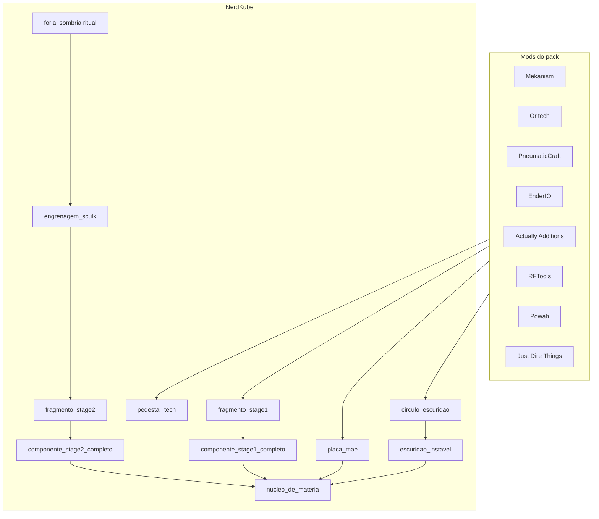
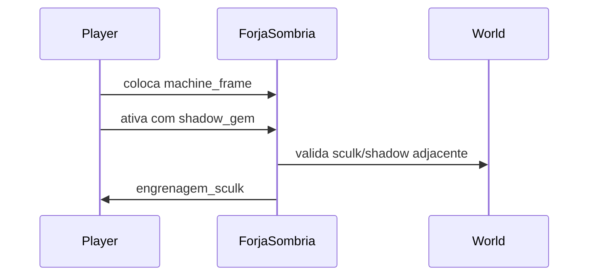

# Progressão Tech + Renderer de Pedestal

**Versão alvo desta entrega:** `0.2.0-SNAPSHOT` (atual: `0.1.0-SNAPSHOT`)

## Fase 0 — Bump de versão

Primeiro passo da implementação: subir a versão do mod para marcar o escopo da progressão tech.

| Arquivo | Alteração |
|---------|-----------|
| [`gradle.properties`](e:\Arquivos_Mods\NerdKube\gradle.properties) | `mod_version=0.2.0-SNAPSHOT` |
| [`src/main/templates/META-INF/neoforge.mods.toml`](e:\Arquivos_Mods\NerdKube\src\main\templates\META-INF\neoforge.mods.toml) | Sem edição manual — usa `${mod_version}` via Gradle |
| JAR gerado | `build/libs/nerdkube-0.2.0-SNAPSHOT.jar` |

Opcional: mencionar `0.2.0` no changelog interno em `docs/modpack/tech-progression.md` (seção "O que mudou nesta versão").

---

## Estado atual

- Ritual endgame funciona em Java ([`RitualService`](e:\Arquivos_Mods\NerdKube\src\main\java\br\com\nerdskube\ritual\RitualService.java)); amuleto tech = `nerdkube:nucleo_de_materia`, pedestal = `nerdkube:pedestal_tech`.
- **Não há receitas** no mod (`data/nerdkube/recipe/` inexistente).
- **Não há BER**; [`RitualPedestalBlockEntity`](e:\Arquivos_Mods\NerdKube\src\main\java\br\com\nerdskube\block\entity\RitualPedestalBlockEntity.java) não sincroniza inventário com o client.
- Pack tem os mods necessários (Mekanism, Oritech, PneumaticCraft, EnderIO, AA, RFTools, Powah, Flux, XNet, CC:Tweaked, Just Dire Things) — **sem KubeJS**; receitas devem ir no JAR do NerdKube como datapack JSON.
- `nerdcube_context.md` não existe — criar [`docs/modpack/tech-progression.md`](e:\Arquivos_Mods\NerdKube\docs\modpack\tech-progression.md) como referência canônica.

---

## Fase 1 — Registrar itens intermediários

Adicionar em [`ModItems.java`](e:\Arquivos_Mods\NerdKube\src\main\java\br\com\nerdskube\registry\ModItems.java):

| ID | Uso |
|----|-----|
| `fragmento_stage1` | Stage 1 parcial |
| `componente_stage1_completo` | Saída Atomic Forge |
| `engrenagem_sculk` | Saída ritual customizado |
| `fragmento_stage2` | Stage 2 parcial |
| `componente_stage2_completo` | Saída Empowerer |
| `placa_mae` | Craft em cruz |
| `circulo_escuridao` | Saída Chemical Crystallizer |
| `escuridao_instavel` | Saída Powah Orb |

Assets mínimos por item: `models/item/{id}.json` (gerado ou `item/generated`), textura placeholder em `textures/item/`, entradas em [`pt_br.json`](e:\Arquivos_Mods\NerdKube\src\main\resources\assets\nerdkube\lang\pt_br.json) / `en_us.json`, inclusão na aba Ingredients em [`NerdKube.java`](e:\Arquivos_Mods\NerdKube\src\main\java\br\com\nerdskube\NerdKube.java).

`nucleo_de_materia` e `pedestal_tech` já existem — só ganham receitas.

---

## Fase 2 — Receitas datapack (JSON no JAR)

Criar `src/main/resources/data/nerdkube/recipe/tech/` com um arquivo por etapa. **Antes de commitar**, validar cada ID no JEI da instância `Nerds Quadrados` (alguns nomes podem diferir da spec, ex. `mekanism:u_u_matter` do addon Unleashed).

| Etapa | Arquivo sugerido | `type` (copiar schema de receita vanilla do mod) |
|-------|------------------|--------------------------------------------------|
| A Pedestal Tech | `pedestal_tech_pressure.json` | `pneumaticcraft:pressure_chamber` — 5×5×5, `pressure`: 16.0 |
| B Fragmento S1 | `fragmento_stage1_alloy.json` | `enderio:alloy_smelting` (ou tipo atual do EnderIO 8.x) |
| C Componente S1 | `componente_stage1_atomic.json` | `oritech:atomic_forge` — energia ~1e9 FE conforme schema Oritech |
| D Fragmento S2 | `fragmento_stage2_craft.json` | `minecraft:crafting_shaped` (padrão 3×3 da spec) |
| E Componente S2 | `componente_stage2_empowerer.json` | `actuallyadditions:empowerer` |
| F Placa-Mãe | `placa_mae_craft.json` | `minecraft:crafting_shaped` |
| G.1 Círculo | `circulo_escuridao_crystallize.json` | `enderio:tank` / crystallizer (confirmar tipo EnderIO 8.x) |
| G.2 Escuridão | `escuridao_instavel_powah.json` | `powah:energizing` — 10e9 FE |
| H Núcleo | `nucleo_materia_reaction.json` | `oritech:reaction_chamber` + fluido `oritech:quantum_infusion` |

**Método de implementação:** extrair 1 receita de exemplo de cada máquina dos JARs em `modpack_mods_dir` e espelhar o JSON. Não usar `RecipeProvider`/datagen nesta fase (overhead alto, mods não são compile-time deps).

IDs da spec a conferir no JEI (risco alto de typo):

- `mekanism:u_u_matter`, `mekanism:synergy_matrix_addon`
- `oritech:etheletic_quartz` (grafia do spec)
- `computercraft:pocket_computer_advanced` (CC:Tweaked mantém namespace `computercraft`)
- `enderio:liquid_darkness`

---

## Fase 3 — Ritual customizado: `forja_sombria` (engrenagem_sculk)

Decisão do usuário: mecânica custom no NerdKube (não só documentação).

### Design

Novo bloco `forja_sombria` + `ForjaSombriaBlockEntity`:

1. Slot único: `rftoolsbase:machine_frame`
2. Ativação (botão na GUI ou right-click): consome o frame e exige **catalisador** `justdirethings:shadow_gem` na mão do jogador (ou 1 gem no slot secundário)
3. Validação opcional de “pulso sombrio”: bloco de sculk ou `justdirethings:shadow_block` em raio 2 (configurável em [`NerdKubeConfig`](e:\Arquivos_Mods\NerdKube\src\main\java\br\com\nerdskube\config\NerdKubeConfig.java))
4. Output: `1× nerdkube:engrenagem_sculk` + partículas/sons
5. Registro em `ModBlocks`, `ModBlockEntities`, loot table, modelo simples (pode reutilizar pipeline [`tools/import_blockbench.py`](e:\Arquivos_Mods\NerdKube\tools\import_blockbench.py))

Integração futura com API real do ShadowPulse (JDT) pode ser camada opcional se o mod expuser evento NeoForge.

---

## Fase 4 — Renderer 3D do amuleto no pedestal

### Sync server → client

Estender [`RitualPedestalBlockEntity`](e:\Arquivos_Mods\NerdKube\src\main\java\br\com\nerdskube\block\entity\RitualPedestalBlockEntity.java):

- `getUpdateTag()` + `getUpdatePacket()` (espelhar [`NerdCubeBlockEntity`](e:\Arquivos_Mods\NerdKube\src\main\java\br\com\nerdskube\block\entity\NerdCubeBlockEntity.java))
- Em [`ThemedPedestalBlock`](e:\Arquivos_Mods\NerdKube\src\main\java\br\com\nerdskube\block\ThemedPedestalBlock.java): após alterar inventário, `level.sendBlockUpdated(pos, state, state, Block.UPDATE_ALL)`

### BER

Novo [`PedestalOfferingRenderer`](e:\Arquivos_Mods\NerdKube\src\main\java\br\com\nerdskube\client\renderer\PedestalOfferingRenderer.java):

- Lê `inventory.getStackInSlot(SLOT_OFFERING)`
- Posição: `(0.5, 1.2, 0.5)` — alinhado ao `InfusionPedestalRenderer` do Mystical Agriculture
- Animação: `sin(millis/800) * 0.065` bob + `rotateY((millis/800 * 40°) % 360)`; escala `0.95` (BlockItem) ou `0.75` (item)
- Render via `ItemRenderer.renderStatic` com luz/overlay do BER (como Mystical Agriculture)
- Manter [`ThemedPedestalBlock.getRenderShape`](e:\Arquivos_Mods\NerdKube\src\main\java\br\com\nerdskube\block\ThemedPedestalBlock.java) em `RenderShape.MODEL` — o modelo JSON renderiza o totem; o BER desenha **somente** o item flutuante (não usar `ENTITYBLOCK_ANIMATED`, que esconde o bloco)

---

## Fase 5 — Documentação e validação

- Criar [`docs/modpack/tech-progression.md`](e:\Arquivos_Mods\NerdKube\docs\modpack\tech-progression.md): fluxograma, tabela receita → máquina → IDs, link para `forja_sombria`
- Atualizar [`docs/modpack/ritual-reference.md`](e:\Arquivos_Mods\NerdKube\docs\modpack\ritual-reference.md) com nota de que `nucleo_de_materia` vem da cadeia tech
- Checklist de teste in-game:
  1. `/reload` sem erros de receita no log
  2. JEI mostra todas as receitas
  3. Craft completo até `nucleo_de_materia`
  4. Colocar amuleto no pedestal → item 3D visível, girando
  5. Ritual final com CubeMaker

---

## Escopo fora desta entrega

- JEI/EMI plugin (receitas cross-mod já aparecem via JEI dos mods)
- Progressão dos outros 3 pedestais (magia/exploração/agricultura)
- FTB Quests (apenas documentar IDs para quest designer)
- Datagen Gradle completo

## Riscos e mitigação

| Risco | Mitigação |
|-------|-----------|
| Schema de receita diferente entre versões de mod | Copiar JSON de exemplo do JAR do pack |
| Item ID inexistente | Validar no JEI antes de merge; log em `/reload` |
| ShadowPulse real do JDT | Ritual `forja_sombria` com shadow_gem + sculk adjacente; extensível depois |
